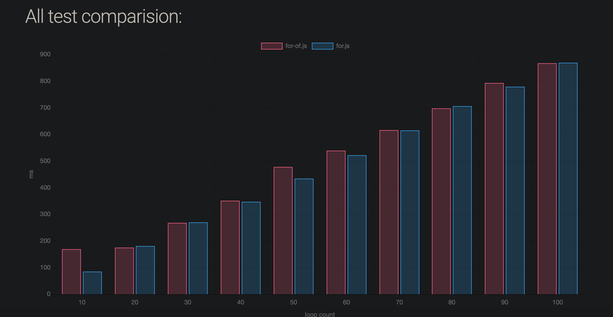

# Micron Benchmark For vs For of
This is a benchmark to analize if there is  performance difference between `for` and `for...of` loop.

## Motivation
In this benchmark we measure the performance variation a huge array (length 10000000) and measuring the time to loop over this array 10-100 times:

```javascript
for (let i = 0; i < elm.length; i++) {
  if(elm[i]===2){
    return true;
  }
}
```
vs
```javascript
for (let current of elm) {
  if(current===2){
    return true;
  }
}
```

## Results

As expected there is no significant difference between both loop functions.

[view results HERE](https://ivanhuay.github.io/micron-for-vs-for-of/)


## run the test

```
git clone https://github.com/ivanhuay/micron-for-vs-for-of.git

cd micron-process-env

npm i

npm run test
```

after running that the results should be on the docs folder.

```
google-chrome docs/index.html

open docs/index.html
```
